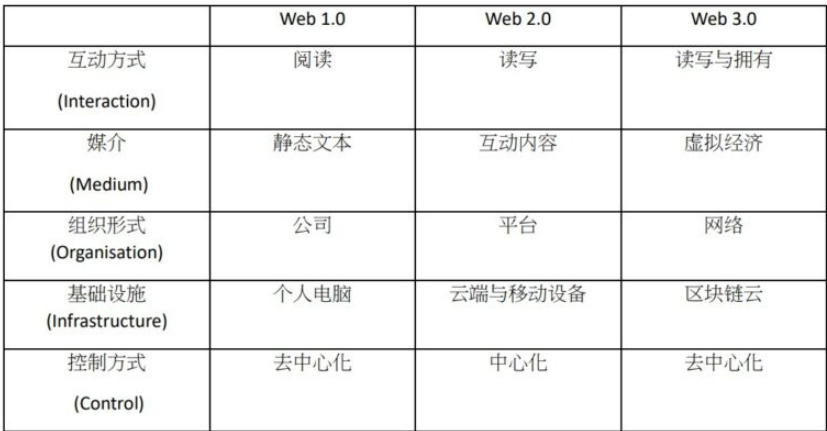
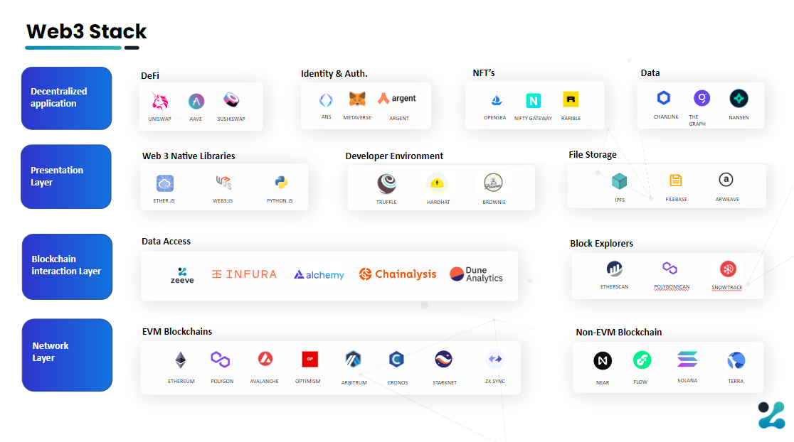

# web3.0-zh

原英文文章链接：https://ethereum.org/en/web3/

## Web3.0是什么？

Web2.0+AI+去中心化=Web3.0 这是最简单的描述方式

_ChatGPT的回答_：**Web3.0是下一代互联网，通过区块链和去中心化技术实现了去中心化的应用、智能合约和用户控制的新型互联网生态系统。**

现有的互联网是集中的，而我们需要一种分布式的互联网 这就是新一代互联网web3.0

_Web3_._0_ 是指_基于_区块链的去中心化在线生态系统。往大了说，_Web3_._0_ 代表了互联网的下一个阶段，也许还能代表人类社会的下一个阶段

Web1.0是可读的，Web2.0是可读可写的，Web3.0是可读可写可拥有的。
Web1.0，2.0，3.0的关系就像是侠盗猎车手1，2，3的关系
它们都是游戏侠盗猎车手，但是内容不一样，3会比2好玩，2会比1好玩

### Web1.0

早期的互联网是静态网页，互联网上的内容是由少部分人发布的，其他人对于互联网只能进行读取，不能进行写入。这样互联网的想象力就被限制了。

总结：**平台创造、平台所有、平台控制、平台受益**

### Web2.0

由于Web1.0的时候，互联网的资源太少了，因为用户只能读取不能写入。 所以需要引入一种交互式的机制。 用户可以从互联网或许信息，也能写入信息，这就是我们现在使用最多的网络Web2.0 Web2.0催生了许多互联网大厂和超级公司的产生。你在网络上发布的内容不属于你，而属于这些公司。

总结：**用户创造、平台所有、平台控制、平台分配**

### Web3.0

Web3.0是读+写+去中心的

一个产品为什么有价值？就是因为它能解决现有产品的弊端。

Web2.0的现存问题有这些：

1**所有权和收益权不合理：** 不符合 “谁创造、谁拥有、谁收益”的市场规则。比如：我在知乎、公众号等渠道发布的几十篇文章，没有收益。

2**平台垄断，并控制用户：** 数亿用户创造的海量内容，无偿提供给平台，催生了多个超级巨头的产生。反过来，巨头开始控制用户，比如：

- 各大内容平台通过算法控制推荐给用户的内容 😡
- 百度搜索首页全是付费广告 😡
- 平台割裂，微信屏蔽支付宝、淘宝、抖音分享，淘宝不支持微信支付等 😡
- 电商平台杀熟 😡
- 在朋友圈发布的内容，被屏蔽仅自己可见 😡

3**数据割裂，且无法迁移：** 即使我们对各大平台的控制已经忍无可忍，但我们没有办法去改变。我们的数据归平台所有，无法迁移。另外就是在当前的模式下，很难诞生白莲花平台。

- 我每次写一篇文章，需要在公众号、掘金、知乎、Github 等各个渠道发布一次。大家对于文章的评论、点赞、关注都是割裂的，属于各个平台，而不是属于我这篇文章
- 我忍受不了微信的垄断，但我也没办法把微信的好友、聊天记录、朋友圈等我创作的内容迁移到其它平台
- 我没办法把知乎的粉丝、文章、评论、关注迁移到掘金
- 我在 QQ 音乐购买的音乐，没法在网易云音乐播放器播放

4**隐私问题：** 我们的社交关系、聊天记录、购物记录、搜索记录等数据，均由各大平台控制，他们可以随意使用我们的隐私数据

5**数据可信度：** 平台提供的数据不可信，比如：

- 我的文章阅读量可能都是虚假的
- 商品的购买量可能都是虚假的
- 推荐的热门视频可能并不是真的热门

6**数据安全性：** 我们的数据由平台中心化存储，如果平台挂了，那我们的数据也没了

为了应对Web2.0的一些弊端，Web3.0出现了。 那什么是去中心呢？ 我们已经有了Web2.0，都是Web2.0中，我们需要一个中心，这个中心帮我们存储信息，传递信息。都是我们的信息放在那里，不一定安全，可能会被黑客盗取，那么所有人的信息都泄露了。

Web3.0实现了反转，将数据的所有权由平台反转到了创造者身上。
谁创作，谁拥有。

而Web3.0是用户对用户的，没有中心，都是好像每一个用户又都是一个中心。 总之，Web3.0的信息传输，就是用户对用户的，没有了中间商。

我们不用把Web3.0的概念限定的太死，它代表的是新一代版本的Web，分布式只是它的特点之一。

总结：**用户创造、用户所有、用户控制、协议分配**

## Web3.0的特点

* Web3是去中心化的：不再有大规模的互联网被中心化实体所控制和拥有，所有权分散在其建设者和用户之间。

* Web3是可拥有的：你的游戏就是你的游戏，不会因为厂商倒闭或者封你号导致你游戏玩不了。

* Web3是无权限的：每个人都有平等的参与Web3的机会，没有人会被排除在外。

* Web3具备本地支付功能：它使用加密货币进行在线消费和转账，而不依赖于过时的银行和支付处理机构的基础设施。

* Web3是无需信任的：它通过激励和经济机制运作，而不依赖于可信第三方。

  

  Web3目前主要用到的技术：

  web2.0基础上的技术加上：solidity,密码学，区块链原理，智能合约，钱包概念，NFT理念，分布式存储（IPFS,星际文件系统 InterPlanetary File System）,http3.0等

## Web3.0常见术语

- **Web3：**它是以太坊区块链 Ethereum blockchain 和你的智能合约 Smart Contracts 之间的连接。

- **以太坊 Ethereum：**一个去中心化的开源区块链 blockchain，允许用户通过创建智能合约 creating smart contracts 与网络进行交互。它的原生加密货币是以太币。就市值而言，以太币是仅次于比特币的第二大最有价值的加密货币。它由 Vitalik Buterin 于 2013 年创建。

- **智能合约 Smart Contracts ：**它们是存储在区块链上的计算机程序 computer programs ，在满足预定条件时运行。智能合约是用 Solidity 语言编写的。

- **去中心化 Decentralized ：**数据状态不由中央实体 central entity、平台 platform 或个人 individual 收集

- **区块链：**区块链网络是一种点对点连接，其中信息在多个设备之间共享，几乎不可能被黑客入侵。它是一种记录信息的系统，其方式使得很难或不可能更改保存在网络上的信息。

- **Solidity：**一种用于编写智能合约 writing smart contracts 的面向对象 object-oriented 的编程语言。它用于在各种区块链平台上实施智能合约，最著名的是以太坊。Solidity 的语法类似于 javascript。要了解 Solidity，最好有 javascript 等编程语言的背景。直接跳入 Solidity 是一个坏主意

- **Dapp：**代表去中心化应用程序 Decentralized App 。它们是在去中心化网络或区块链上运行其后端代码（主要用 Solidity 编写的智能合约）的应用程序。可以使用 react、vue 或 Angular 等前端框架构建 Dapps。

## 入门Web3.0的资源

了解这些基本常识后，就可以行动了。你可以通过以下步骤进行探索。

- [Get a wallet](https://ethereum.org/en/wallets/)
- [Find a community](https://ethereum.org/en/community/)
- [Explore Web3 applications](https://ethereum.org/en/dapps/)
- [Join a DAO](https://ethereum.org/en/dao/)
- [Build on Web3](https://ethereum.org/en/developers/)

## Web3学习路线!!!

知道所需的技能树后,根据自己实际情况进行

- 如何开发一个DApp?
  知道了这些,就能明白为什么需要那些技术,语言,能力
  DApp和Web2.0的程序一样,也需要前端和后端,只不过使用的技术不一样,
  才让它具备了Web3.0的那些特性比如去中心化

  - 前端

    - 语言

      JavaScript 语言    

    - 编辑器

      Vscode

    - 框架

      React(最多) or Vue框架
      与Web2.0没啥区别

  - 后端

    - 语言

      solidity

    - 编辑器

      [Remix](https://github.com/ethereum/remix-ide)

      Remix是solidity的IDE编辑器,类型python的pycharm和vscode

    - 框架

      HardHat

      Hardhat是一个基于javascript和solidity的开发框架，可以快速提升你的应用程序的开发速度。你可以查看[hardhat-starter-kit](https://link.zhihu.com/?target=https%3A//github.com/smartcontractkit/hardhat-starter-kit)，了解一下hardhat项目的使用案例。

    - 基础底层库

      - ethers.js

      - web3.js

        - Web3.js是一个库集合，允许您使用 HTTP、IPC 或 WebSocket 与本地或远程以太坊节点进行交互。

        - **Web3.js**允许您开发与区块链交互的网站或客户端。例如，它允许您将以太币从一个账户发送到另一个账户、从智能合约读取和写入数据、创建智能合约等等！

        - **Web3.js**可用于前端和后端检查账户余额、从区块链读取数据、进行交易，甚至部署智能合约。

  - 智能合约工具

    - **Chainlink**

      Chainlink是[区块链预言机](https://link.zhihu.com/?target=https%3A//chain.link/education/blockchain-oracles)，它是一个让智能合约成为[混合智能合约](https://link.zhihu.com/?target=https%3A//blog.chain.link/hybrid-smart-contracts-explained/)的工具，它包括一些链外组件，并与现实世界连接。智能合约很好，但它们有一个巨大的问题，就是没有以任何方式与外部世界相连。要使用一些链外组件（如数据或链下计算）来保持智能合约去中心化，就必须让链外数据和计算去中心化，而这正是Chainlink网络和工具的作用。

    - **Openzeppelin**

      [Openzeppelin](https://link.zhihu.com/?target=https%3A//openzeppelin.com/)巩固了自己作为 “solidity标准库 ”的地位。任何时候，任何开发者（包括我自己）都在寻找一种快速的方法来[部署NFT/ERC721](https://link.zhihu.com/?target=https%3A//www.youtube.com/watch%3Fv%3Dp36tXHX1JD8)、[ERC20](https://link.zhihu.com/?target=https%3A//betterprogramming.pub/python-blockchain-token-deployment-tutorial-create-an-erc20-77a5fd2e1a58)、[可升级合约](https://link.zhihu.com/?target=https%3A//www.youtube.com/watch%3Fv%3DbdXJmWajZRY)、[DAO/治理](https://link.zhihu.com/?target=https%3A//github.com/brownie-mix/dao-mix)，或者任何在这个领域的开发者想做的项目，十有八九，你会想去找一个Openzeppelin包。

      Openzeppelin是一套已经写好的智能合约，所以你不需要重新发明轮子。我在项目中使用他们已经审计过的可扩展智能合约，为我节省了无数的时间。我无法强调Openzeppelin是多么的重要。我想在我大约80%的教程中，我都在以某种方式使用Openzeppelin。

  - 区块链浏览器

    [Etherscan](https://etherscan.io/)

  - 钱包

    部署智能合约，需要一个钱包来存储资金或至少是测试网的资金。出于各种目的，下面这些钱包会经常用到。

    **BitPay**
用于Bitcoin的
    
Buy, store, swap and spend cryptocurrency all in one app. Turn Bitcoin into dollars with the BitPay crypto debit card. Earn cash back automatically.
    
**MetaMask**
    MetaMask是用于Ethereum的

    Metamask是一个[热钱包](https://link.zhihu.com/?target=https%3A//www.gemini.com/cryptopedia/crypto-wallets-hot-cold)，很容易上手。热钱包的问题是，一旦你的私钥泄露，你就完蛋了！此外，它们总是连接到互联网上，所以如果有人进入你的电脑，你可能也会完蛋！幸运的是，有一些有用的其他工具供我们使用。
    
    如果没钱,用metamask(比如我)
    
    

一旦你完成这些学习路线,你就可以

- Minting NFTs
- Creating cryptocurrencies
- Making DApps (decentralized application)

你可以开始构建项目、运行代码并跟随教程，然后将你的成果添加到简历中。

完成这些步骤后，你就可以开始寻找工作机会，并有机会赚取六位数的收入（针对其他国家而言）。

## Web3完整技术栈

## Web3.0的已有应用

既可以说Web3.0是一个概念，也可以说它是一个生态，或者是一个愿景。 它并不是一种具体的技术。比如说TOP1高校，好像有些学校在里面也不在里面，好像可以说微博是基于Web2.0一样。 如果非要说，那么Web3.0的已有应用有这些

- [Web3.0入门](README.md)
- [区块链&比特币](qu-kuai-lian.md)
- [智能合约](zhi-neng-he-yue.md)
- [NFT](NFT.md)
- [加密货币](jia-mi-huo-bi.md)
- [元宇宙](yuan-yu-zhou.md)
- [ChatGPT](ChatGPT.md)