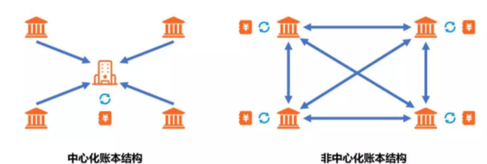

# 区块链&比特币

## 什么是分布式账本技术?

分布式账本是一种金融上的去中心化手段,对于传统的账本,所有用户把账本交给平台管理. 而分布式账本是所有用户自己保留一份账本的copy,这样既自己保留了账本,其他人也无法篡改.  除非你能让全世界的分布式账本拥有者在同一时间修改同一内容.
也就是说,平台不篡改你的账本是出于平台本身的责任和权威,而分布式账本不篡改你的账本,是因为根本篡改不了.



## 什么是区块链?

区块链的英文是blockchain,是分布式账本技术的一种实现方式
我们之前说的分布式账本,是一个技术.就好像前端框架技术有Vue,有React
Vue就是前端框架几乎的一种实现.  一个是理论,一个是实现

区块链技术由经过验证的区块组成，然后添加到一个链上（因此得名区块链）。

每个区块包含一个特定时间段内经过验证的交易列表。这是每个人都可以看到的；也就是说，你可以回去看区块链上的每一笔交易。

```
分布式分类帐是一种在分散式网络的成员之间共享，复制和同步的数据库。使用密码术可以安全准确地存储有关此分类帐的所有信息。可以使用密钥和加密签名访问此信息。分布式分类账允许交易拥有公开的“证人”，这使得网络攻击更加困难。它记录网络参与者之间的交易，例如：资产或数据的交换。
网络中的所有参与者管理并就分类帐中记录的更新达成共识。没有中央机关，或者涉及金融机构或政府机构等第三方调解员。分布式分类帐中的每条记录都有一个时间戳和唯一的加密签名。这使得分类帐成为网络中所有事务的可审计，不可变的历史记录。
此外，如果对分类帐进行了任何更改，则会在几秒或几分钟内反映并复制到所有参与者。换句话说，当在分类帐中发生任何更改或更新时，每个节点构造新事务，然后节点通过一致性算法对哪个副本正确进行投票。一旦确定了一致性算法，所有其他节点就会使用新的正确的分类帐副本自行更新。
分布式账本的主要优点是缺乏中央权威。正如我们所知，集中式分类账容易发生网络攻击，分布式分类账本身就很难攻击。这是因为所有分布式副本都需要同时受到攻击才能使攻击成功。

```


我们来讨论一下为什么区块链 比如比特币,能够有那么高的价值?
货币的英文名是currency,有流通的意思,也有货币的意思
其实能流通的东西就能成为货币.  而比特币在Web3.0的世界里面是最具流通性的,
公链的基础就是共识技术,而共识技术的基础就是你能看到每个人的账单,而这个账单,就是区块链,也就是比特币,以太坊.

## 区块链的三个核心优势

区块链技术修复了互联网未设计的三个东西，这三个东西是：

- 价值

  使用区块链，实际上可以在数字资产上创造价值。该价值可以由拥有它的人控制。它可以在没有中间集中代理的情况下通过互联网传输独特的资产。

- 信任

  区块链可以安全地分配特定数字资产的所有权，并能够跟踪一次实际控制该资产的人员。换句话说，区块链创建了一个永久，安全，不可更改的记录，表明谁拥有什么。它使用高级哈希加密技术来保持信息的完整性。

- 可靠性

  区块链在全球数千台不同的计算机上分配工作量。它提供了可靠性，因为如果将所有内容都集中在一个位置，它就会成为单点故障。但是，它的分散式网络结构确保没有单点故障可能导致整个系统崩溃。

  

## 区块链vs数据库

### 区块链

区块链是一种数据库或分类帐，它将信息存储在称为块的数据结构中。它基于分布式分类帐技术，可以在不相互信任的各方之间使用。当在区块链中添加任何内容时，它需要来自网络上所有其他用户的验证。

区块链将信息永久保存在统一大小的块中。每个块存储来自前一个块的散列信息以提供加密安全性。区块链哈希使用SHA256哈希算法，一种单向哈希函数。先前块的哈希值可以追溯到区块链中产生的第一个块，称为“生成块”。区块链数据结构采用Merkle树的形式，用作验证数据的有效方式。

### 数据库

数据库是管理员管理所有内容的一种中央分类帐。管理员在此处授予读取，写入，更新或删除操作的权限。由于它本质上是集中的，它们的维护容易，并且产量高。但它也有一个缺点，当它被破坏时，可能危及整个数据，甚至可能改变数字记录的所有权。

数据库使用客户端 - 服务器网络体系结构。数据库管理员有权对数据的任何部分及其结构进行更改。

## 什么是公链?

公链是区块链的一种应用形式，指的是基于区块链技术构建的开放、公开和去中心化的网络。公链中的数据和交易是公开可查的，任何人都可以加入公链网络，参与验证和记录交易。

因此，公链是区块链技术的一种具体实现，它利用区块链技术的特点构建了一个开放、公开且去中心化的网络环境。除了公链之外，还有其他形式的区块链应用，如联盟链（由多个特定组织或机构参与的私有链）和私有链（由单个组织或机构控制的链）等。

总而言之，区块链是一种技术，而公链是基于区块链技术构建的一种应用形式。公链是区块链技术的一种重要实现方式，具有去中心化、公开和透明等特点，被广泛应用于加密货币和其他领域的应用。

### 比较有名的公链

- 比特币
- 以太坊
- EOS

### 公链的不可能三角

**去中心化程度、安全性、性能**。至今没有一条公链可以做到足够的去中心化、又安全可靠、又高效可扩展。  多链共存是未来的发展方向

- 比特币公链是以去中心化和安全性为主，牺牲了性能；
- 以太坊是以去中心化与性能为主，牺牲了安全性；
- EOS是以安全与扩展性为主，牺牲了去中心化。
  因为它牺牲了去中心化这个最核心技能,所以现在不如前两个币了.

### 公链的技术

- 非对称加密技术

- P2P点对点网络技术

- **共识算法技术**

  什么是共识机制?网络中51%的节点必须就网络的全球状态达成一致，以便达成共识。
  说白了,举例子说明就是:如果一半以上的节点被控制,那么就能进行篡改账本.因为51%就达成了共识
  比特币使用的是POW工作量证明的共识算法，通过计算出具某种算力的工作量证明，来获取参与区块链的凭证和奖励，这个奖励也就是大家所熟知的BTC

  这就是为什么可以挖矿,这就导致了可以通过算力得到币

  但是,这样会导致能耗增加,不环保.
  因此一些新币出来了
  权益证明PoS（Proof of Stake），委托权益证明DPoS（Delegated Proof of Stake），权威证明PoA（Proof of Authority），使用时间证明PoET（Proof of Elapsed Time），容量证明PoC（Proof of Capacity），空间证明PoSpace（Proof of Space），烧毁证明PoBurn（Proof of Burn）

- 
  主流的共识算法

  除了POW就是POS机制，POS是通过质押加密资产的多少来决定由谁来记帐，就像现实世界的股票一样，谁的股票多谁就有话语权。但这也带来了某人可以通过获取大量加密资产来垄断控制权的问题。DPoS是在PoS的基础上变化，由投票选出节点代运行，类似股东们选出董事会一样。但POS机制由于牺牲了去中心化，也一直被质疑不会成为未来真正成熟的公链机制。

总结. 区块链很重要的一个底层几乎就是分布式记账技术,而谁记账,谁就有了权力,有了资源,也就是有了钱.   那我们怎么评定谁记账?就是通过共识算法.
主流的共识算法的机制有POW和POS,POW通过算力评定谁记账,POS通过加密货币资产决定谁记账.

## 公链与私有链、联盟链

- 公链 人人参与记帐
- 联盟链 许可的部分人可以
- 私有链 只有少部分人可以

作者本人认为只有公链才是真正的区块链

## 比特币是什么?

什么回答这个问题可能很难回答,但是结合上面那些概念大家就明白它的真实含义了.

- 比特币是基于公链的一种技术,而公链又是基于区块链的一种技术.
- 一种加密货币

## 比特币挖掘

比特币挖掘是将交易记录添加到比特币过去交易的公共分类账的过程

为什么这样能获取比特币?
因为比特币的机制-共识算法,你提供了算力,就能获取比特币

比特币的区块链时矿工创作的吗?

是的，比特币的区块链是由矿工通过挖矿创造出来的。矿工通过解决复杂的数学问题来验证交易，并将它们打包到一个区块中。每当一个新的区块被添加到区块链中时，矿工将获得一定数量的比特币作为奖励。这个过程被称为挖矿，它是维持比特币网络安全和运行的关键部分。

## 比特币价格

比特币就像一种商品。它的价格取决于它所交易的市场，即比特币的价格取决于某人愿意支付多少比特币。市场确定比特币的价格与其它商品(如：黄金，石油，糖，谷物等)相同。比其他任何市场的比特币都受供求规则的约束。遵循基础的经济学原理，即 

```shell
需求增加，供应减少 = 价格上涨
供应增加，需求减少 = 价格下降
```

## 虚拟货币的双重支出问题

到A店用2块钱买了一瓶水,然后到B店这两块钱还能买一瓶水吗?
不行,因为已经花掉了. 而虚拟货币则存在这个风险
因此，比特币交易有可能被复制和重播。这开辟了同一BTC可由其所有者花费两次的可能性。

如何解决:分布式账本,而比特币就是一种分布式账本

## 区块链交易流程

1. 交易被创造

2. 交易数据被记录并编译成一个区块

   区块包含的交易数据例如:
   时间,发送地址,接收地址,交易的数额,哈希值

3. 完成的区块被分发给区块链网络中的每个节点

   如何既让其他人能验证,同时又能保护它们的隐私?
   通过哈希函数比如SHA-256,这样它们计算的是一串哈希值了

   那哈希碰撞怎么处理?共识机制!哈希碰撞概率很少,总不可能百分之50以上的人哈希碰撞吧.

   哈希值是不可逆的,所以哈希函数不是用于加密传输的,而是用于数据完整性验证和数据索引的

   **举个例子，假设您要下载一个文件，下载完成后，您可以通过计算文件的哈希值并与提供的哈希值进行比对来验证文件的完整性**

   因为,一个值应该哈希得到的哈希值是固定的,两个人使用同样的数据进行哈希一定会得到一个同样的值.
   所以我对完整的数据,先进行哈希,那么得到一个true-hash
   那么用户对文件进行哈希,如果值和true-hash一致,
   就说明这是完整的文件

   

   ```md
   在区块链中，交易信息通常是公开可见的，但参与交易的地址通常是加密的，只能通过它们的公钥或哈希值来识别。所以，您能看到的是交易的哈希值，而不是具体的交易信息。
   
   在您的例子中，如果A向B转账2比特币，这个交易会被记录在区块链中，并生成一个交易哈希值。这个哈希值可以被其他人看到，以验证交易的存在和有效性。但具体的交易信息（例如发送方和接收方的地址、转账金额等）通常是加密的，只能由参与者使用私钥解密和查看。
   
   这种方式保护了用户的隐私，同时确保了交易的透明性和不可篡改性。其他人可以验证交易的有效性，但无法直接了解交易的具体细节。
   ```

   

4. 所有操作员在网络中运行节点来验证这个被分发的区块

   这些操作员就是矿工,为什么它们挖矿?因为共识机制,你提供了算力来帮助维持比特币社区的共识机制的运行,就会给你奖励,这个奖励就是bitcoin.

   在比特币中，不能像创建普通法定货币(如美元，欧元和人民币)那样创造资金。比特币是通过奖励这些矿工来解决这些数学和密码问题而创建的。 谁贡献算力,谁获取比特币,当然,你也可以从金钱去购买比特币,都是那不是创作的比特币,而是转移比特币到另一个人手中

5. 验证完毕后,区块被加入这个链,交易完成

 

## 以太坊

https://ethereum.org/en/

以太坊是一种开源的区块链平台，它允许开发者构建和部署智能合约和去中心化应用程序（DApps）。以太坊的核心是以太币（Ether），它是其加密经济系统的本地加密货币。以太坊的目标是提供一个去中心化的平台，用于构建各种应用，从金融交易到数字资产管理，甚至是社交网络和游戏等领域。以太坊的特点包括智能合约功能、可编程性、分布式应用开发、去中心化自治组织（DAO）等。

每个区块链都有自己的生态系统，我们要从其中选择一条。以太坊是不错的选择
集平台&学习资料&资源&货币一体

比如后端很重要的,也就是智能合约需要的语言solidity. 就需要在Remix IDE上面写
[Remix - Ethereum IDE](https://remix.ethereum.org/)

## 以太坊vs比特币

**比特币**的主要是用作虚拟**货币**并存储价值，而**以太币**也可以实现相同的功能，但是，去中心化的**以太坊**网络还可以实现部分其他的功能，例如创建和运行应用程序、签订智能合同以及进行其他类型的交易，而所有这些功能都是**比特币**所不具备的

总结:比特币更注重投资价值,作为一种货币,而以太坊不仅可投资,也有很多其他价值.  两者的侧重点不一样. 

- 1
  - 比特币主要关注于成为一种数字货币，强调安全性和去中心化，
  - 以太坊则更加注重于构建智能合约和支持去中心化应用的平台

- 2
  - 比特币（Bitcoin）是第一个成功的加密货币，它的主要目标是作为一种去中心化的数字货币系统。比特币的核心理念是提供一种无需信任第三方的电子支付系统
  - 以太坊（Ethereum）则是一种开放的区块链平台，旨在为去中心化应用（DApps）提供基础设施。以太坊的侧重点在于智能合约和可编程性。它允许开发者构建和部署智能合约，这些合约可以自动执行特定的操作，而不需要中间人的参与。以太坊的区块链上也有自己的加密货币，称为以太币（Ether），但以太坊的设计目标远不止于此。